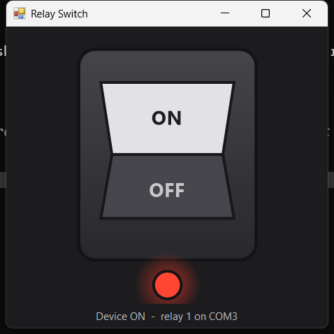

# Relay Switch

Portable single-file GUI controlling a device wired through the NC contacts of an
LCUS-style CH340 USB relay board.



## Wiring

The load is on the **normally-closed** contacts, so the device is powered whenever
the relay coil is de-energized:

| Frame sent | Coil | NC contacts | Device |
|---|---|---|---|
| `A0 01 00 A1` | de-energized | closed | **powered ON** |
| `A0 01 01 A2` | energized | open | **powered OFF** |

Losing control — app exit, sleep, USB reset, unplug — restores power rather than
stranding the device off. This setup can cut power on demand but **cannot hold a
device off unattended.**

The inversion lives in exactly one place: `RelayPort.NormallyClosed`. Flip that single
constant if the load is ever moved to the NO contacts.

## Usage

Double-click `RelaySwitch.exe`. The switch opens in the ON position, restoring power.
Click to cut power, click again to restore it. The window keeps a square aspect ratio
at any size. Right-click for "Always on top" and "Retry / rescan ports".

| Flag | Effect |
|---|---|
| `--selftest` | Runs hardware-free assertions on frame bytes and the NC inversion; exit code 0 = pass |
| `--probe` | Lists detected relay boards; sends nothing to the hardware |
| `--preview` | Shows the switch graphic with no serial port attached |

## Building

Run `build.cmd`. It uses the `csc.exe` built into Windows, so there is nothing to
install and no internet access needed. The code targets the .NET Framework 4.0 API
surface, so the ~20 KB output runs on all Windows 10 releases and Windows 11.

## Related

`relay.ps1` controls the same board from the command line and keeps working while the
GUI is running, because the port is opened per command rather than held open.

```powershell
.\relay.ps1 -State on
.\relay.ps1 -State pulse -DurationMs 500
```

Note that `relay.ps1` speaks **coil** state, not device state — it predates the NC
wiring, so `-State on` energizes the coil and therefore powers the device **off**.
