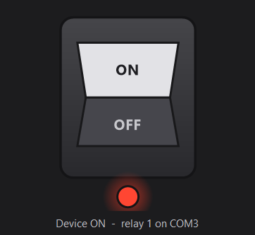

# Relay Switch

Portable single-file GUI controlling a device wired through the NC contacts of an
LCUS-style CH340 USB relay board.

<p align="center">
  
</p>

## Download

Grab `RelaySwitch.exe` from the [latest release](https://github.com/TD-4242/USB-Relay-Switch/releases/latest)
and double-click it. No install, no runtime, no internet — a single ~18 KB file that
runs on Windows 10 and 11.

## Compatible hardware

Developed and tested against an **LCUS-1 USB relay module** — a single-channel 5 V board
with an on-board WCH CH340 USB-to-serial bridge. These are sold under many brand names
(Taidda, SMAKN, NYBG, and others) but are the same reference design; the one used here
is [ASIN B07WFVN1FK](https://www.amazon.com/dp/B07WFVN1FK).

| | |
|---|---|
| USB hardware ID | `USB\VID_1A86&PID_7523` (WCH CH340) |
| Channels | 1 |
| Board power | 5 V from USB |
| Serial | 9600 baud, 8 data bits, no parity, 1 stop bit |
| Command frame | `A0 <channel> <state> <checksum>` |
| Terminals | NO / COM / NC screw terminals |
| Contact rating | Typically 10 A @ 250 V AC, 10 A @ 30 V DC — **check the marking on your own relay can before switching mains** |

### What else should work

- **Any CH340-based relay board speaking the `A0` frame protocol.** Detection matches on
  the CH340 hardware ID, and the frame checksum is computed rather than hardcoded.
- **Multi-channel LCUS boards (LCUS-2, LCUS-4).** They will be detected and channel 1
  will work, but this app only drives channel 1 — the other channels are not exposed.

### What will not work

- **HID-based USB relay boards** (commonly `VID_16C0&PID_05DF`). These are not serial
  devices at all and are neither detected nor addressable by this protocol.
- **Relay boards using a different USB-serial chip** (FTDI, CP2102, PL2303). Even where
  the command protocol matches, auto-detection filters on the CH340 hardware ID, so
  these will report "No relay board found".
- **Boards using a different command protocol**, such as the `FF 01 01` family or ones
  expecting ASCII `ON`/`OFF`.

If your board is serial-based and speaks the `A0` protocol but uses another USB chip,
changing `RelayPort.HardwareIdPrefix` is the only edit needed.

## Wiring

The load is on the **normally-closed** contacts, so the device is powered whenever
the relay coil is de-energized:

| Frame sent | Coil | NC contacts | Device |
|---|---|---|---|
| `A0 01 00 A1` | de-energized | closed | **powered ON** |
| `A0 01 01 A2` | energized | open | **powered OFF** |

Losing control — app exit, sleep, USB reset, unplug — restores power rather than
stranding the device off. This setup can cut power on demand but **cannot hold a
device off unattended.**

The inversion lives in exactly one place: `RelayPort.NormallyClosed`. Flip that single
constant if the load is ever moved to the NO contacts.

## Usage

Double-click `RelaySwitch.exe`. The switch opens in the ON position, restoring power.
Click to cut power, click again to restore it. The window keeps a square aspect ratio
at any size. Right-click for "Always on top" and "Retry / rescan ports".

| Flag | Effect |
|---|---|
| `--selftest` | Runs hardware-free assertions on frame bytes and the NC inversion; exit code 0 = pass |
| `--probe` | Lists detected relay boards; sends nothing to the hardware |
| `--preview` | Shows the switch graphic with no serial port attached |

## Building

Run `build.cmd`. It uses the `csc.exe` built into Windows, so there is nothing to
install and no internet access needed. The code targets the .NET Framework 4.0 API
surface, so the ~18 KB output runs on all Windows 10 releases and Windows 11.

## Releasing

Pushing a version tag builds the exe on a Windows runner, gates it on `--selftest`,
and publishes a GitHub Release with the binary attached:

```bash
git tag v0.0.2
git push origin v0.0.2
```

## Related

`relay.ps1` controls the same board from the command line and keeps working while the
GUI is running, because the port is opened per command rather than held open.

```powershell
.\relay.ps1 -State on
.\relay.ps1 -State pulse -DurationMs 500
```

Note that `relay.ps1` speaks **coil** state, not device state — it predates the NC
wiring, so `-State on` energizes the coil and therefore powers the device **off**.
